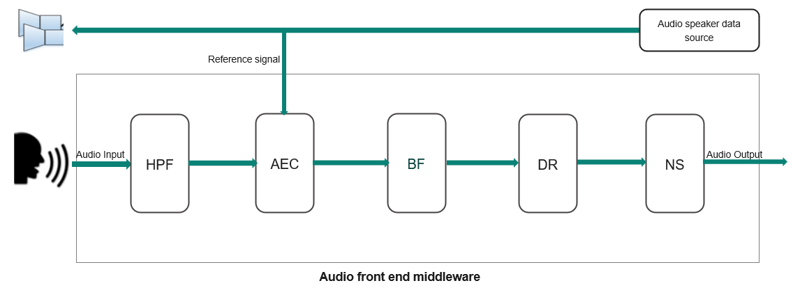

# Audio Front-End (AFE) Middleware Library

## Overview
AFE is an agnostic audio processing technology for more accurate voice command recognition (far-field or close field) by removing interfering sounds captured from the microphone. It extracts the user's voice and cancels unintended sounds, providing clearer speech recognition and better wake word detection.



### Supported Algorithms
The audio front-end middleware supports the following algorithms:

1. **Beamforming (BF):** Uses two or more microphones to form a spatial filter, extracting signals from a specific direction and reducing contamination from others.
2. **Noise Suppression (NS):** Reduces stationary background noise.
3. **Acoustic Echo Cancellation (AEC):** Cancels acoustic feedback between a speaker and microphone. Audio played to the speaker is fed back as reference data to the AEC algorithm to remove acoustic effects.
4. **Dereverberation (DR):** Removes reverberation effects from sound.

AFE middleware provides easy-to-use APIs for feeding audio data, which is internally filtered and returned as clean audio signals to the user application. The Audio Front-End Configurator GUI tool (included with ModusToolbox&trade; IDE) allows users to configure components and generates `*.c`/`*.h` files for compiling with the middleware.

## Features
- Supports NS, AEC, BF, and DR audio algorithms
- Option for applications to provide their own buffer for AFE output data
- Supports feeding mono and stereo data
- Includes the 'audio-fe-configurator' tool

## Supported Platforms
- PSoC&trade; Edge E84 MCU

## Supported Toolchains
| Toolchain     | Version                        |
|--------------|-------------------------------|
| Arm Compiler | Arm&reg; Embedded Compiler 6.22 |
| LLVM Compiler| LLVM&reg; Embedded Compiler 19.1.5|

## Dependencies
The Audio Front-End library depends on the following libraries:
- [audio-voice-core](https://github.com/infineon/audio-voice-core)
- [freertos](https://github.com/infineon/freertos)
- [connectivity-utilities](https://github.com/infineon/connectivity-utilities)
- [audio-voice-core](https://github.com/infineon/audio-voice-core)
- [ml-middleware](https://github.com/infineon/ml-middleware)
- [ml-tflite-micro](https://github.com/infineon/ml-tflite-micro)

---

## Quick Start

### 1. Add Dependencies
Include the required libraries using the 'Library Manager' tool:
- freertos
- connectivity-utilities
- audio-voice-core
- ml-middleware
- ml-tflite-micro

### 2. Configure AFE
Use the AFE Configurator tool to set up components. It generates `cy_afe_configurator_settings.c` and `cy_afe_configurator_settings.h`, which must be placed in your application directory.

### 3. Application Makefile Configuration

#### Basic Defines
Add the following to your application's makefile:
```makefile
DEFINES+=ENABLE_AFE_MW_SUPPORT
```

#### Required Components
```makefile
COMPONENTS+=FREERTOS RTOS_AWARE
```

#### Machine Learning (ML) Components (for advanced features)
These are required for advanced noise suppression (DSNS) and echo suppression (DSES) algorithms using neural networks:

- **DSNS (Deep Speech Noise Suppression):** Advanced noise reduction
- **DSES (Deep Speech Echo Suppression):** Enhanced echo cancellation
- **U55 IP:** Hardware accelerator for neural network processing

Add to your makefile:
```makefile
COMPONENTS+=ML_TFLM ML_INT8x8 U55 MW_MDL_DSES MW_MDL_DSNS
DEFINES+=TF_LITE_STATIC_MEMORY USE_MTB_ML
```

To place the DSNS model in socmem (required for U55 IP):
```makefile
DEFINES+=CY_ML_MODEL_MEM=.cy_socmem_data
```

#### Audio Voice Core (AVC) Component
Choose one of the following options:
```makefile
COMPONENTS+=AVC_DEMO   # Limited functionality for evaluation
# or
COMPONENTS+=AVC_FULL   # Full functionality (production use)
```
   **Note:** AVC_DEMO provides limited functionality for evaluation purposes. For production use with full AVC capabilities, use AVC_FULL. Contact Infineon support for licensing information and access to the full version.

#### Tuning Feature (Optional)
To enable dynamic tuning of AFE parameters via the configurator tool:
```makefile
DEFINES+=CY_AFE_ENABLE_TUNING_FEATURE
```
Disable this macro for optimized performance in production builds.

#### Logging (Optional)
AFE middleware disables all log messages by default. To enable logging:
```makefile
DEFINES+=ENABLE_AUDIO_FRONT_END_LOGS
```
Uncomment or add this define as needed for debugging. Then, call the `cy_log_init()` function from the *cy-log* module (part of *connectivity-utilities*). For details, see the [connectivity-utilities API documentation](https://Infineon.github.io/connectivity-utilities/api_reference_manual/html/group__logging__utils.html).

---

## Additional Information
- [Audio front-end RELEASE.md](./RELEASE.md)
- [Connectivity utilities API documentation - cy-log details](https://Infineon.github.io/connectivity-utilities/api_reference_manual/html/group__logging__utils.html)
- [ModusToolbox&trade; Software Environment, Quick Start Guide, Documentation, and Videos](https://www.infineon.com/cms/en/design-support/tools/sdk/modustoolbox-software/)
- [Audio front-end library version](./version.xml)
